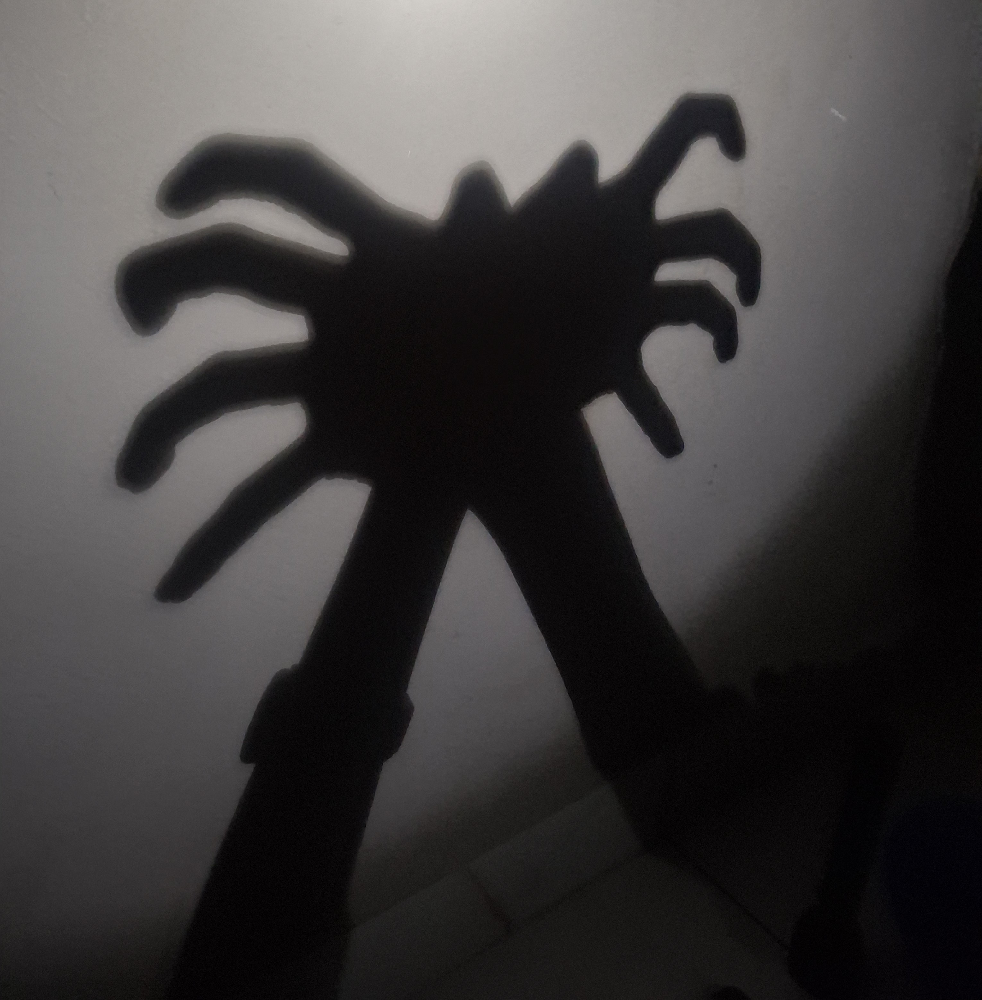
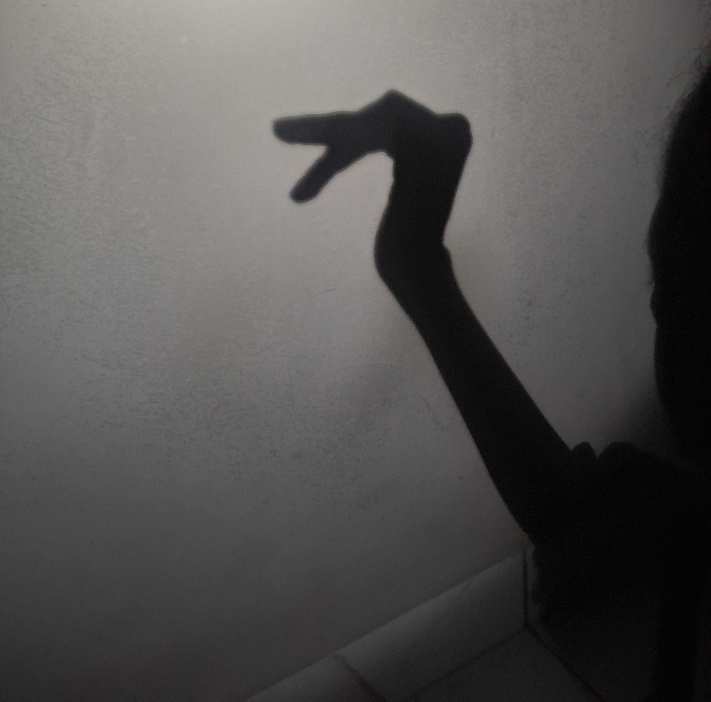
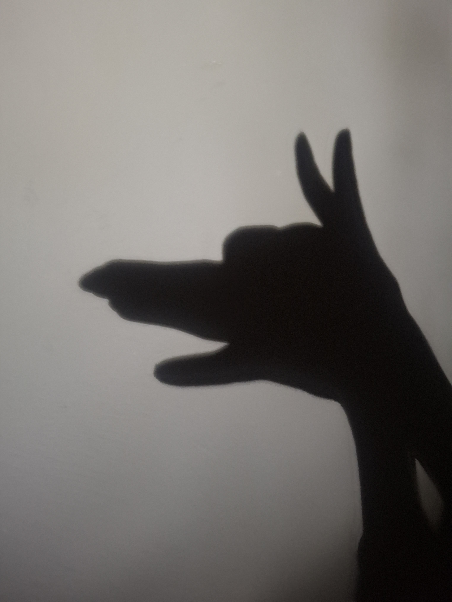
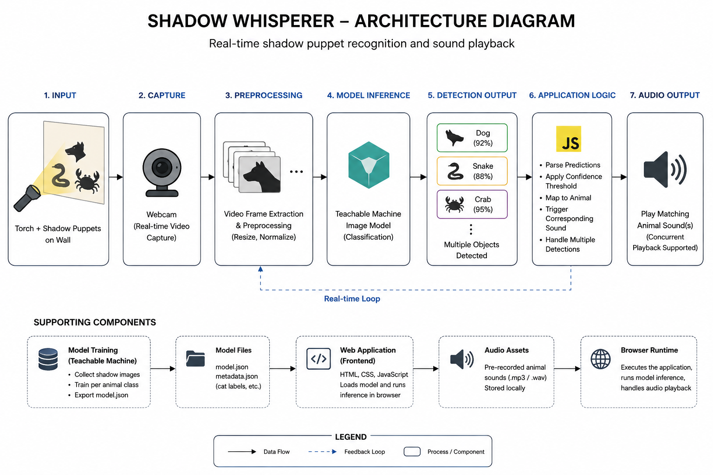

# The Shadow-Whisperer

## Basic Details
### Team Name: Pixel Pixies

### Team Members
- Team Lead: Sanjana Sujith - Muthoot Institute of Technology and Science
- Member 2: Aafia Gause - Muthoot Institute of Technology and Science

### Project Description
Shine a light, make a shadow, and let the forest come alive. 
Shadow Whisperer recognizes your animal shadow puppets and gives them their own sounds.
It is completely unnecessary, slightly ridiculous, and surprisingly fun.
Because honestly, who said useless projects cannot be magical?

### The Problem (that doesn't exist)
We think every shadow puppet deserves a voice.

### The Solution (that nobody asked for)
Shadow Whisperer watches your shadow through the camera, figures out whether it is a dog, crab, or snake, and makes the correct animal sound. Because apparently shadows needed a voice, if you are willing to listen.

## Technical Details
### Technologies/Components Used
For Software:
- Languages used: HTML, CSS, JavaScript
- Libraries used: Teachable Machine, TensorFlow.js
- Tools used: Visual Studio Code, Git, GitHub
- AI tools used: OpenAI Codex for development assistance
- Machine Learning: Google Teachable Machine for training the shadow animal classification model and real time webcam based recognition

### Implementation
For Software:
# Installation
git clone https://github.com/sanjanarose-pixel/shadow-whisperer.git and cd shadow-whisperer

# Run
python -m http.server 8000

### Project Documentation
For Software:

# Screenshots

## Meet the Shadow Puppets you can try out! 🌿
To start with, we've trained the model with the below 3 shadow puppets. Try them all out!

### 🦀 Crab
Our shadow crab brings a little beach chaos into the forest.

### 🐍 Snake
A simple hand shadow turns into a sneaky little snake.

### 🐕 Dog
Because apparently even shadows need a loyal companion.

# Diagrams

### Project Demo
# Video

Working of our project
https://drive.google.com/file/d/1Kw3ovx8kJvHuzukIrOUJKjNnEQjmLx5m/view?usp=drivesdk

A fun tutorial on how you can bring the shapes to life!
https://drive.google.com/file/d/1Ab47_4uNKS3unxKfmtRotrjKmhVMhZdZ/view?usp=drivesdk

## Team Contributions
* **Sanjana Sujith:** Worked on training and testing the Teachable Machine model, prepared the animal shadow datasets for the crab, dog, and snake, and helped evaluate and improve recognition accuracy. Connected the Teachable Machine model.
* **Aafia Gause:** Developed the web application, integrated the webcam based shadow detection, and implemented the animal recognition and sound triggering logic.

---
Made with ❤️ at TinkerHub Useless Projects 

