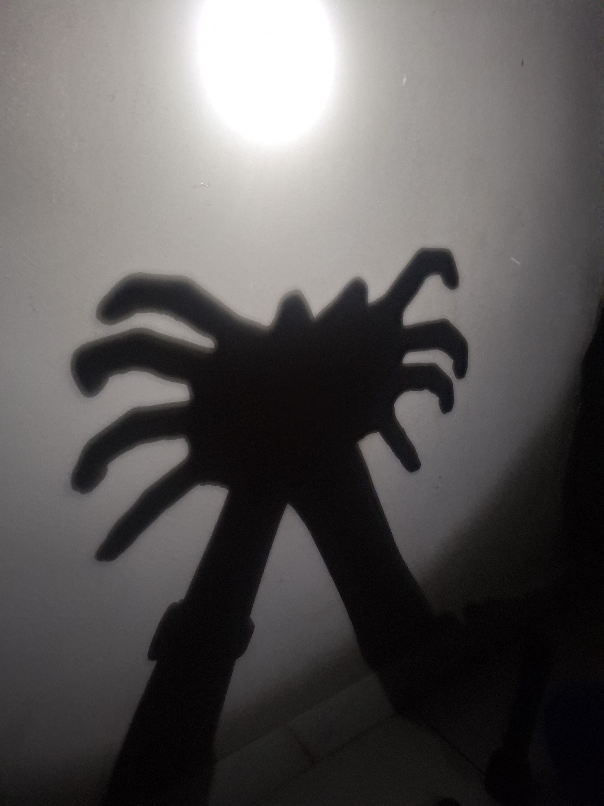

# Shadow Whisperer 🎯

## Basic Details
### Team Name: Pixel Pixies

### Team Members
- Team Lead: Sanjana Sujith - Muthoot Institute of Technology and Science
- Member 2: Aafia Gause - Muthoot Institute of Technology and Science

### Project Description
Shine a light, make a shadow, and let the forest come alive. 
Shadow Whisperer recognizes your animal shadow puppets and gives them their own sounds.
It is completely unnecessary, slightly ridiculous, and surprisingly fun.
Because honestly, who said useless projects cannot be magical?

### The Problem (that doesn't exist)
Sometimes you have a perfectly good shadow puppet and absolutely no idea what animal it is. Honestly, unacceptable.

### The Solution (that nobody asked for)
Shadow Whisperer watches your shadow through the camera, figures out whether it is a dog, crab, or snake, and makes the correct animal sound. Because apparently shadows needed a voice.

## Technical Details
### Technologies/Components Used
For Software:
- Languages used: HTML, CSS, JavaScript
- Libraries used: Teachable Machine, TensorFlow.js
- Tools used: Visual Studio Code, Git, GitHub
- AI tools used: OpenAI Codex for development assistance
- Machine Learning: Google Teachable Machine for training the shadow animal classification model and real time webcam based recognition

### Implementation
For Software:
# Installation
git clone https://github.com/sanjanarose-pixel/shadow-whisperer.git
cd shadow-whisperer

# Run
python -m http.server 8000 and Open http://localhost:8000 in your browser and allow webcam access.

### Project Documentation
For Software:

# Screenshots (Add at least 3)

## Meet the Shadow Puppets you can try out! 🌿

### 🦀 Crab
Our shadow crab brings a little beach chaos into the forest.

### 🐍 Snake
A simple hand shadow turns into a sneaky little snake.

### 🐕 Dog
Because apparently even shadows need a loyal companion.

# Diagrams

*Add caption explaining your workflow*

For Hardware:

# Schematic & Circuit

*Add caption explaining connections*

*Add caption explaining the schematic*

# Build Photos

*List out all components shown*

*Explain the build steps*

*Explain the final build*

### Project Demo
# Video
[Add your demo video link here]
*Explain what the video demonstrates*

# Additional Demos
[Add any extra demo materials/links]

## Team Contributions
- [Name 1]: [Specific contributions]
- [Name 2]: [Specific contributions]
- [Name 3]: [Specific contributions]

---
Made with ❤️ at TinkerHub Useless Projects 

